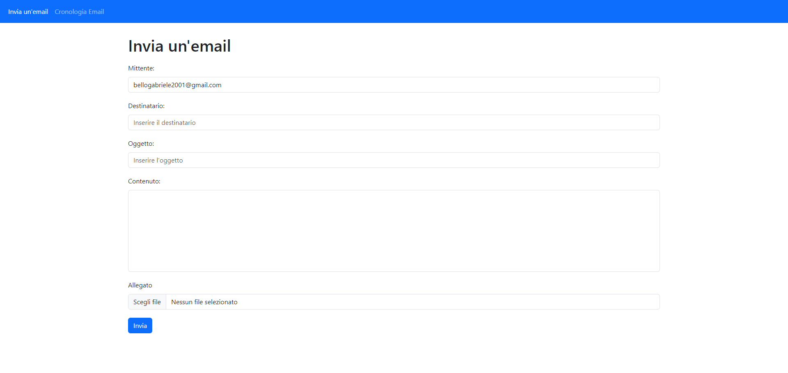

# Send Email App

## Key features:
- Email sending with attachment
- Email saving, viewing and deleting

## Technologies used:
- Python + Django + Django Rest Framework
- JavaScript + React + Axios
- Bootstrap

## Config
### Backend .env:
EMAIL_HOST_USER = 'email'\
EMAIL_HOST_PASSWORD = 'email_app_password'\
SECRET_KEY = 'django-secretkey'\
FILE_PATH_FIELD_DIRECTORY = 'media_files/'

### Frontend .env:
VITE_EMAIL_HOST_USER = 'email'\
VITE_API_URL = 'base_url'\
VITE_FILE_PATH_DIRECTORY = 'media_files/'

## Screenshots

